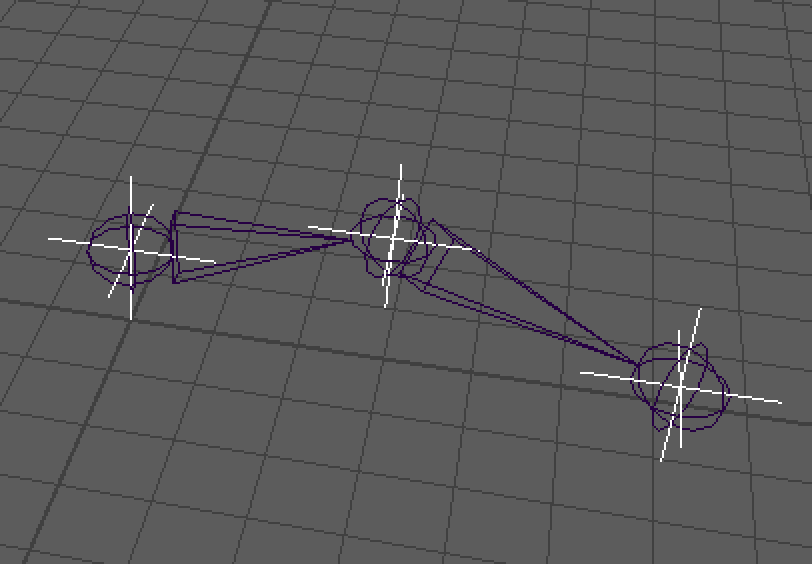

| Plug-ins | maya |
|:--------:|:--------:|
|Mode lock|False|

# Algebra Basics



## Presentation
The goal of this node is to work the basics of the algebra.

This node compute the matrices of 3 outputs parented from 3 world position in input.
You can move interractively the inputs, the node compute the output. 


## Attributs

```bash
inputs: {
    shoulder_pos
    elbow_pos
    wrist_pos
    parentInverseMatrix
}
outputs: {
    shouler_xform
        |-output_shouler_translate
        |    |- output_shouler_translateX  
        |    |- output_shouler_translateY  
        |    |- output_shouler_translateZ  
        |-output_shouler_rotate
        |    |- output_shouler_rotateX  
        |    |- output_shouler_rotateY  
        |    |- output_shouler_rotateZ  
        |-output_shouler_scale
        |    |- output_shouler_scaleX  
        |    |- output_shouler_scaleY  
        |    |- output_shouler_scaleZ

    elbow_xform
        |-output_elbow_translate
        |    |- output_elbow_translateX  
        |    |- output_elbow_translateY  
        |    |- output_elbow_translateZ  
        |-output_elbow_rotate
        |    |- output_elbow_rotateX  
        |    |- output_elbow_rotateY  
        |    |- output_elbow_rotateZ  
        |-output_elbow_scale
        |    |- output_elbow_scaleX  
        |    |- output_elbow_scaleY  
        |    |- output_elbow_scaleZ

    wrist_xform
        |-output_wrist_translate
        |    |- output_wrist_translateX  
        |    |- output_wrist_translateY  
        |    |- output_wrist_translateZ  
        |-output_wrist_rotate
        |    |- output_wrist_rotateX  
        |    |- output_wrist_rotateY  
        |    |- output_wrist_rotateZ  
        |-output_wrist_scale
        |    |- output_wrist_scaleX  
        |    |- output_wrist_scaleY  
        |    |- output_wrist_scaleZ
}
```

## Node editor Connection


## Commands (python)

### Main commands

build :

```Python
from maya import cmds

cmds.file(new=True, f=True)
cmds.loadPlugin("dvAlgebraPlug.py")
cmds.file(new=True, f=True)

root_grp = cmds.createNode("transform", n="root_GRP")
targets_grp = cmds.createNode("transform", n="targets_GRP")
deform_grp = cmds.createNode("transform", n="deform_GRP")

cmds.setAttr(targets_grp + ".inheritsTransform", 0)

cmds.parent(targets_grp, root_grp)
cmds.parent(deform_grp, root_grp)

algerbra_node = cmds.createNode("dvAlgebraPlug")

locators = {
        "shoulder_target": [0.0, 1.0, 0.0],
        "elbow_target": [1.0, 1.0, -1.0],
        "wrist_target" : [3.0, 1.0, -1.0]
    }

locator_nodes = []
for loc, pos in locators.items():
    current_loc = cmds.spaceLocator(n=loc)[0]
    cmds.xform(current_loc, ws=True, t=pos)
    locator_nodes.append(current_loc)

for locator_node in locator_nodes:
    base_name = locator_node.split("_")[0]
    cmds.connectAttr(locator_node + ".worldPosition[0]", algerbra_node + "." + base_name + "_pos")

cmds.parent(locator_nodes, targets_grp)

cmds.select(d=True)
jnts=["shoulder_JNT", "elbow_JNT", "wrist_JNT"]
jnt_nodes=[]
for jnt in jnts:
    base_name = jnt.split("_")[0]
    current_jnt = cmds.joint(n=jnt)
    for attr in ["translate", "jointOrient", "scale"]:
        
        if attr == "jointOrient":
            node_attr = "rotate"
        else:
            node_attr = attr
            
        for axis in ["X", "Y", "Z"]:
            cmds.connectAttr(algerbra_node + ".output_{}_{}{}".format(base_name, node_attr, axis), current_jnt + ".{}{}".format(attr, axis))

    jnt_nodes.append(current_jnt)
    
cmds.parent(jnt_nodes[0], deform_grp)

cmds.connectAttr(deform_grp + ".worldInverseMatrix[0]", algerbra_node + ".parentInverseMatrix", f=True)

```